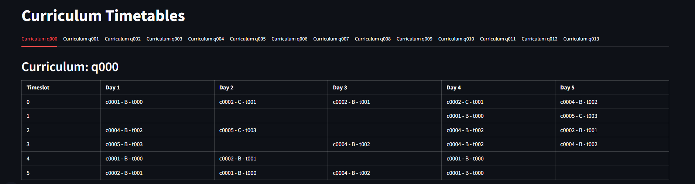

# Flexy Timetable

Данный проект упрощает процесс составления и корректирования расписания в учебных заведениях.

Чтобы создать полноценный программный продукт, требуется найти эффективный подход к составлению расписания. Первая фаза проекта посвящена именно этому этапу. Поэтому в данном репозитории нет полноценного демонстрационного продукта, а лишь демонстрация возможностей алгоритма (спойлер: идеальное расписание получить не удалось).

## Installation & Launch

1) Клонировать репозиторий;
2) Установить библиотеки pandas, numpy, mosa;
3) Обновить пути до файлов с данными и решениями в variables.py;
4) Запустить код в configurator.ipynb или для демонстрации существующего решения streamlit_demonstration.py.

## Solution Details

Multi-Objective Simulated Annealing (MOSA) – это метаэвристический алгоритм, позволяющий найти баланс между различными целями оптимизации и формирующий т.н. фронт Парето оптимальности. В поставленной цели я выделил две основные задачи: обеспечение надежности расписания и соответствие установленным ограничениям.

Принцип работы MOSA (для справки)

- Алгоритм начинает с генерации случайного решения и применяет к нему различные операции (изменение значения, вставка, удаление) для создания новых решений.
- Каждое новое решение оценивается с помощью функции цели, которая определяет его качество.
- Принятие или отклонение решения зависит от параметра "температура". При высокой температуре алгоритм более склонен принимать решения, даже если они хуже предыдущих, что способствует исследованию новых областей пространства решений. По мере снижения температуры алгоритм сосредотачивается на оптимизации и улучшении текущего решения, приближаясь к оптимальному результату.

Опишем оптимизационные цели:
1) **Качество решения** (Penalty): Этот критерий фокусируется на минимизации нарушений установленных ограничений. Ограничения делятся на "мягкие" и "твердые". "Твердые" ограничения обычно являются обязательными (например, невозможность одновременного присутствия одного преподавателя в двух местах), а "мягкие" ограничения часто связаны с предпочтениями и оптимизацией (например, идеальное распределение перерывов между занятиями). Нарушение любого из этих ограничений приводит к начислению штрафных очков, и цель состоит в том, чтобы минимизировать общий штраф.

2) **Надежность решения** (Robustness): Этот критерий направлен на минимизацию влияния непредвиденных изменений на расписание. Это может включать, например, способность расписания адаптироваться к отмене занятий или изменению аудиторий без серьезного нарушения остальной части расписания. Так же, как и в случае с качеством решения, надежность оценивается через штрафные очки за потенциальные нарушения. 

## Results

К сожалению, не удалось отобразить результаты работы на графиках.

На данный момент лучшим показателем является 288. Это означает, что в расписании наших учебных программ нет пересечений и нарушений "твердых" ограничений (балл за каждое "твердое" нарушение - 500). 

Резюмируя, с данным алгоритмом реально приблизиться к оптимальному решению, однако необходима существенная доработка:

- доработка исходного кода;
- доработка штрафной функции;
- внедрение ограничений, которые более приближены к реальности.

Резюмируя проделанную работу:

- изучено несколько исследовательских статей;
- реализовано несколько штрафных функций, рефакторинг кода;
- прокачены навыки промпт-инжиниринга.

Примечание: надежность решения было реализовано, но отключено впоследствии, поскольку был выставлен приоритет в составлении расписания наиболее соответсвующего ограничениям.

## Plans

Доработать данный алгоритм, опробовать гибридные метаэвристические алгоритмы.

## Useful Links

- [Meta-heuristic approaches for the University Course Timetabling Problem](https://www.sciencedirect.com/science/article/pii/S2667305323000789)
- [ITC-2007 dataset](https://github.com/Docheinstein/itc2007-cct/tree/master/datasets)
- [MOSA](https://github.com/rgaveiga/mosa)

## Log

20-02-2024: Опробован алгоритм MOSA (Multi-Objective Simulated Annealing) на данных с ITC-2007. Нужно больше тестов и доработка штрафных функций.